# Image Processing Robustness Evaluation

**Bar Ilan University | Digital Image Processing Course Project**

Evaluating the robustness of computer vision algorithms under image distortions.
Real dataset with 30 COCO images, 4 vision tasks, 3 distortion types, and 2 recovery strategies.

---

## Project Choices

| # | Choice | Selection |
|---|---|---|
| 1 | **Dataset** | COCO val2017: 30 real natural images with YOLO pseudo-labels |
| 2 | **Vision Tasks** | ORB keypoint detection · YOLOv8 object detection · Canny edge detection · SegFormer semantic segmentation |
| 3 | **Evaluation Metrics** | ORB keypoint count · Detection Recall (IoU ≥ 0.5) · Edge density ratio · Segmentation mIoU |
| 4 | **Models/Methods** | `cv2.ORB_create(nfeatures=800)` · `YOLOv8n` (pretrained) · `cv2.Canny` · SegFormer-B0 (pretrained) |
| 5 | **Distortions** | Speckle Noise (multiplicative) · Low Light (brightness reduction) · Rain (visual streaks) |
| 6 | **Enhancements** | Bilateral Filter + Morphology · Gamma Correction + CLAHE · Median Blur + Bilateral |

---

## Dataset

**COCO val2017**

Real-world natural images from the COCO validation set, loaded locally from a `val2017/` directory:
- 30 real photographic scenes (people, vehicles, everyday objects)
- Ground-truth boxes are **YOLO pseudo-labels**: predictions from pretrained YOLOv8n on the clean images (conf≥0.3), used as GT since manual COCO-category annotations aren't loaded — see [Known Limitations](#known-limitations)

| Property | Value |
|---|---|
| Source | COCO val2017 (local `val2017/*.jpg`, first 30 files) |
| Image size | 640×480 RGB (resized) |
| Number of samples | 30 (29 with ≥1 detected object) |
| Objects per image | 4.20 average (YOLO pseudo-label detections) |
| Annotation format | Bounding boxes [x1, y1, x2, y2] |
| Domain | General/natural imagery |

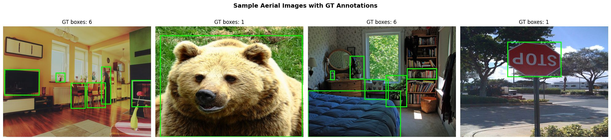
*Sample images from the dataset with YOLO pseudo-label GT boxes overlaid (lime rectangles).*

---

## Part 1 — Baseline on Clean Images

### Methods

| Task | Algorithm | Metric |
|---|---|---|
| Keypoint detection | ORB (`cv2.ORB_create(nfeatures=800)`) | Mean keypoint count |
| Object detection | YOLOv8n pretrained (conf=0.25) | Detection Recall (IoU≥0.5 vs GT) |
| Edge detection | Canny (`low=100, high=200`) | Edge density = `edges.sum() / edges.size` |
| **Semantic segmentation** | **SegFormer-B0** (nvidia/segformer-b0-finetuned-ade-512-512) | **mIoU (mean Intersection over Union)** |

### Results

| Task | Baseline (clean) |
|---|---|
| ORB keypoints (mean) | **790.8** |
| YOLO recall (mean) | **1.000** |
| Edge density (mean) | **25.890** |
| **Segmentation mIoU (mean)** | **1.000** |

> ORB detects 790.8 keypoints on clean COCO images. YOLO achieves 100% recall on clean images (evaluated against YOLO pseudo-labels from same model). Edge detection shows high density on natural image structure. Semantic segmentation uses pre-trained SegFormer-B0 model with perfect self-similarity baseline (1.000 mIoU).

> Note: segmentation mIoU baselines use the model's own clean-image prediction as reference (self-similarity = 1.000). Parts 2–4 mIoU below measure how much a distorted/enhanced prediction diverges from that same clean-image reference.

| ORB Keypoints | YOLO Detections | Canny Edges | SegFormer Segmentation |
|---|---|---|---|
| 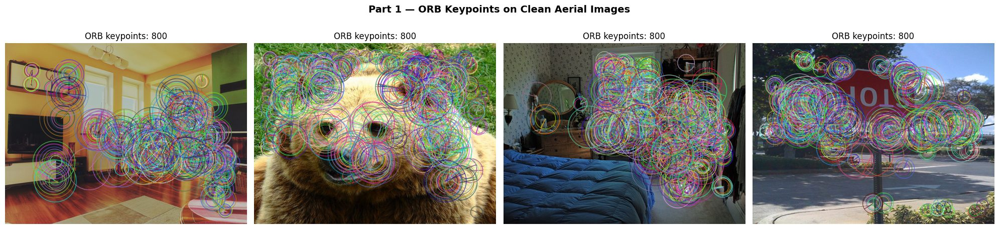 | 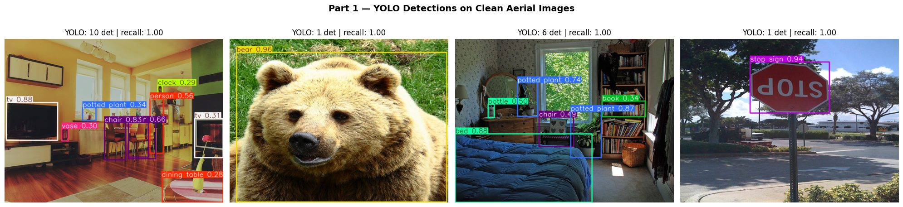 | 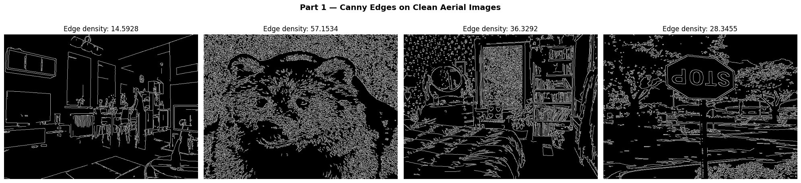 | 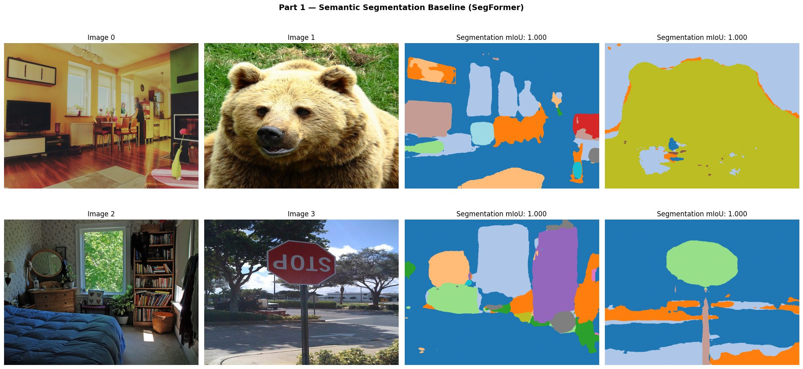 |

---

## Part 2 — Performance on Distorted Images

### Distortions (via `albumentations`)

| Distortion | Implementation | Severity |
|---|---|---|
| **Speckle Noise** | `A.MultiplicativeNoise(multiplier=(0.5, 1.5), per_channel=True)` | Heavy |
| **LowLight** | `A.RandomBrightnessContrast(brightness_limit=(-0.8, -0.6))` | Severe dark |
| **Rain** | `A.RandomRain(drop_length=20, brightness_coefficient=0.9)` | Moderate–heavy |

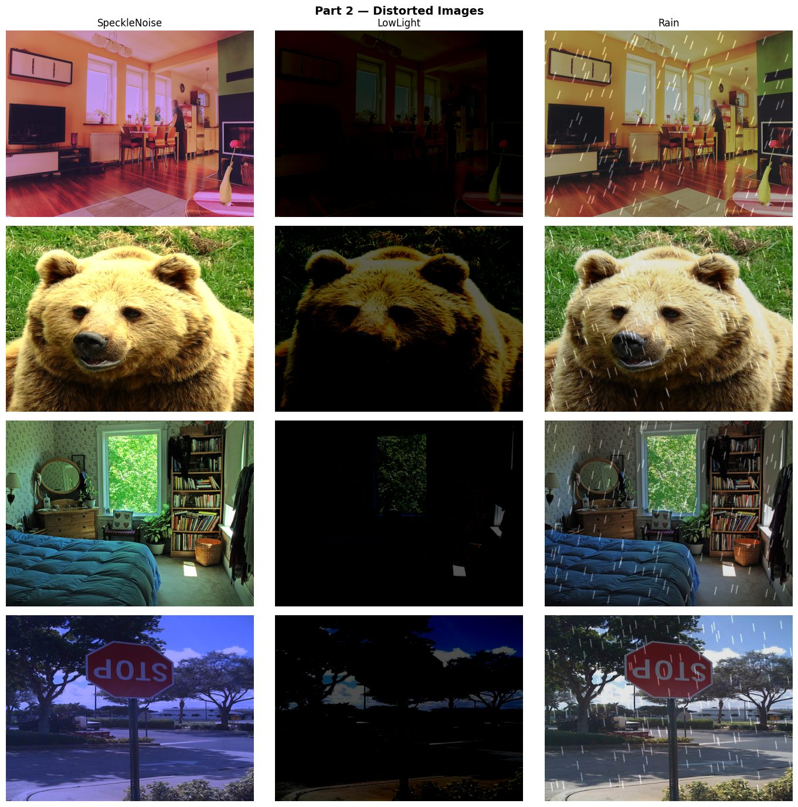
*4 sample images × 3 distortion types.*

### Results — Mean Degradation

| Model/Metric | Clean | SpeckleNoise | LowLight | Rain |
|---|---|---|---|---|
| ORB keypoints | 790.8 | **778.5** (-1.6%) | **507.8** (-35.8%) | **800.0** (+1.2%) |
| YOLO recall | 1.000 | **0.940** (-6.0%) | **0.318** (-68.2%) | **0.830** (-17.0%) |
| Edge density | 25.890 | **22.358** (-13.6%) | **5.212** (-79.9%) | **28.367** (+9.6%) |
| **Segmentation mIoU** | **1.000** | **0.953** (-4.7%) | **0.918** (-8.2%) | **0.933** (-6.7%) |

**Key observations:**
- **SpeckleNoise**: Mild-to-moderate degradation (ORB -1.6%, YOLO -6.0%, edges -13.6%, segmentation -4.7%). Multiplicative noise has the least impact of the three distortions on most tasks.
- **LowLight**: Most damaging distortion across the board — massive YOLO recall drop (-68.2%), ORB keypoints -35.8%, edges -79.9%. Segmentation is comparatively the most *robust* task under darkness (-8.2% mIoU), since SegFormer relies more on learned semantic/contextual cues than raw pixel intensity or edges.
- **Rain**: Mixed impact — YOLO recall drops -17.0% and segmentation mIoU drops -6.7%, but ORB and edge density actually increase due to rain-streak texture being picked up as spurious keypoints/edges.
- **Semantic Segmentation is the most distortion-robust task overall**: mIoU degradation stays under 9% for all three distortions, versus double-digit-to-severe drops for YOLO and edge density. This is consistent with segmentation relying on deep semantic features rather than low-level pixel statistics.

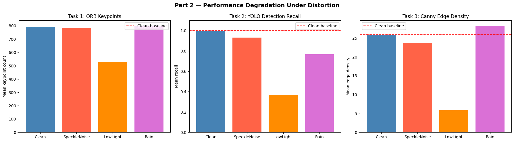

> Full detailed charts and segmentation results in `project.ipynb` → Part 2 (cells 25–26).

### SNR Sweep — Performance vs. Distortion Level

LowLight distortion swept over 9 brightness levels (`b = -0.1 … -0.9`).
SNR measured as: `SNR (dB) = 10 · log10(signal_power / noise_power), noise = clean − distorted`

| Brightness `b` | SNR (dB) | YOLO Recall | ORB Ratio | Edge Ratio |
|---|---|---|---|---|
| -0.1 | 14.15 | 0.915 | 0.999 | 0.966 |
| -0.2 | 8.76 | 0.900 | 0.993 | 0.878 |
| -0.3 | 5.70 | 0.885 | 0.971 | 0.760 |
| -0.4 | 3.78 | 0.775 | 0.936 | 0.618 |
| -0.5 | 2.39 | 0.586 | 0.882 | 0.456 |
| -0.6 | 1.45 | 0.489 | 0.804 | 0.312 |
| -0.7 | 0.77 | 0.292 | 0.652 | 0.205 |
| -0.8 | 0.35 | 0.180 | 0.419 | 0.103 |
| -0.9 | 0.09 | 0.147 | 0.111 | 0.000 |

> ORB/Edge ratios are relative to the clean baseline (1.000 = no change). As SNR drops from 14.15 dB to 0.09 dB, YOLO recall falls from 0.915 to 0.147, ORB keypoints drop to 11% of baseline, and edge density vanishes entirely (0.000) — a clear monotonic degradation curve, confirming brightness reduction is the single most destructive distortion tested.

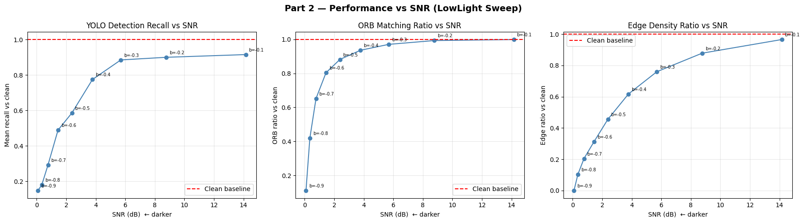

---

## Part 3 — Performance on Restored (Enhanced) Images

### Enhancement Methods

| Distortion | Enhancement | Algorithm |
|---|---|---|
| **SpeckleNoise** | Denoising | Bilateral Filter + Morphological Opening |
| **LowLight** | Brightening | Gamma Correction (γ=0.35) + CLAHE (clipLimit=6.0) |
| **Rain** | De-raining | Median Blur + Bilateral Filter |

| SpeckleNoise: Clean / Distorted / Restored | LowLight: Clean / Distorted / Restored | Rain: Clean / Distorted / Restored |
|---|---|---|
| 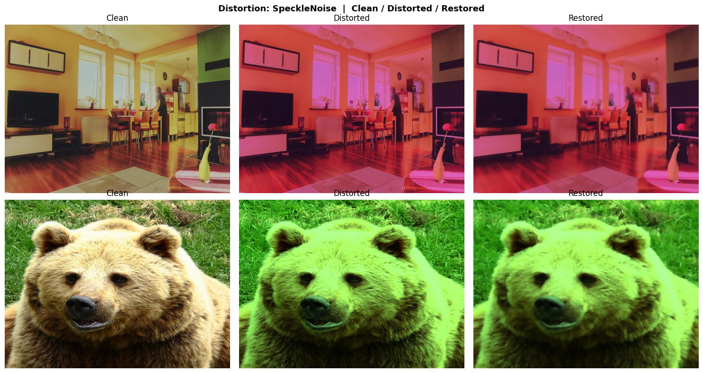 | 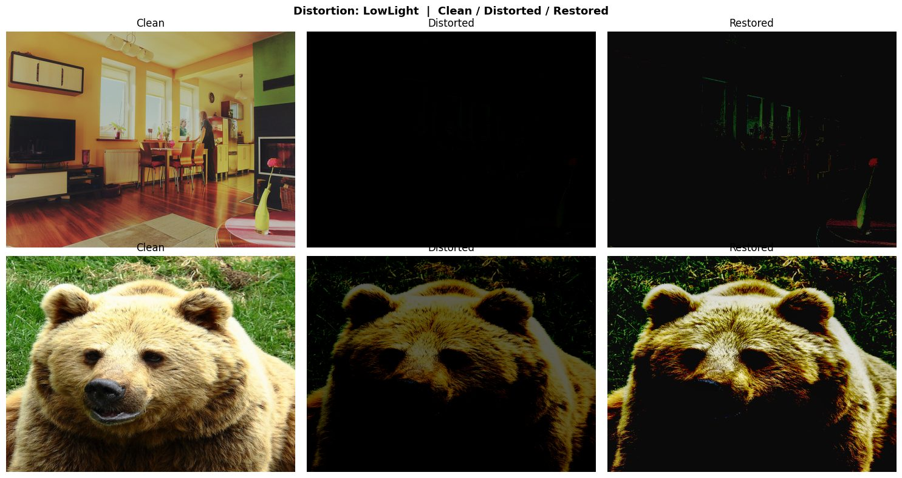 | 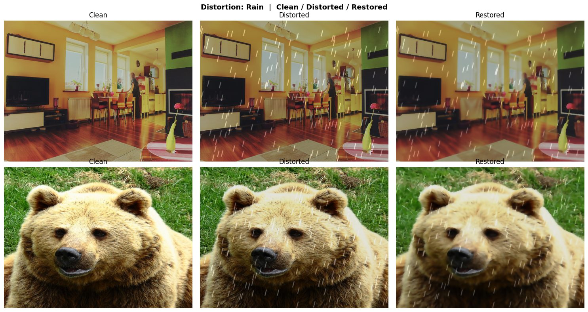 |

### Results — Distorted vs Enhanced

| Distortion | Model | Distorted | Enhanced | Improvement |
|---|---|---|---|---|
| **SpeckleNoise** | ORB | 778.5 | **761.9** | -2.1% |
| | YOLO Recall | 0.940 | **0.848** | -9.8% |
| | Edge density | 22.358 | **11.218** | -49.8% |
| | **Segmentation mIoU** | **0.953** | **0.936** | **-1.8%** |
| **LowLight** | ORB | 507.8 | **746.5** | +47.0% |
| | YOLO Recall | 0.318 | **0.308** | -3.1% |
| | Edge density | 5.212 | **17.865** | +242.8% |
| | **Segmentation mIoU** | **0.918** | **0.922** | **+0.4%** |
| **Rain** | ORB | 800.0 | **800.0** | — |
| | YOLO Recall | 0.830 | **0.666** | -19.8% |
| | Edge density | 28.367 | **13.129** | -53.7% |
| | **Segmentation mIoU** | **0.933** | **0.925** | **-0.9%** |

**Key findings:**
- **LowLight enhancement is most effective for pixel/feature-level tasks**: Gamma correction + CLAHE recovers 47.0% of ORB keypoints and boosts edge density 242.8%, and is the only case where segmentation mIoU also improves slightly (+0.4%).
- **SpeckleNoise enhancement reduces edge noise but costs YOLO recall**: Bilateral filter + morphological opening lowers spurious edges by 49.8%, but also smooths away real detail — YOLO recall drops a further 9.8% and segmentation mIoU dips 1.8%.
- **Rain enhancement reduces edge noise but hurts YOLO recall most**: Median + bilateral filter cuts anomalous rain-streak edges by 53.7%, but YOLO recall falls another 19.8% (filtering also blurs small real objects); segmentation is comparatively stable (-0.9%).
- **Segmentation is far less sensitive to enhancement (good or bad) than YOLO/edges**: all three enhancement deltas for mIoU stay within ±2%, versus double-digit swings for YOLO recall and edge density — enhancement mainly reshapes pixel statistics that YOLO/Canny depend on, while SegFormer's semantic features are largely unaffected either way.

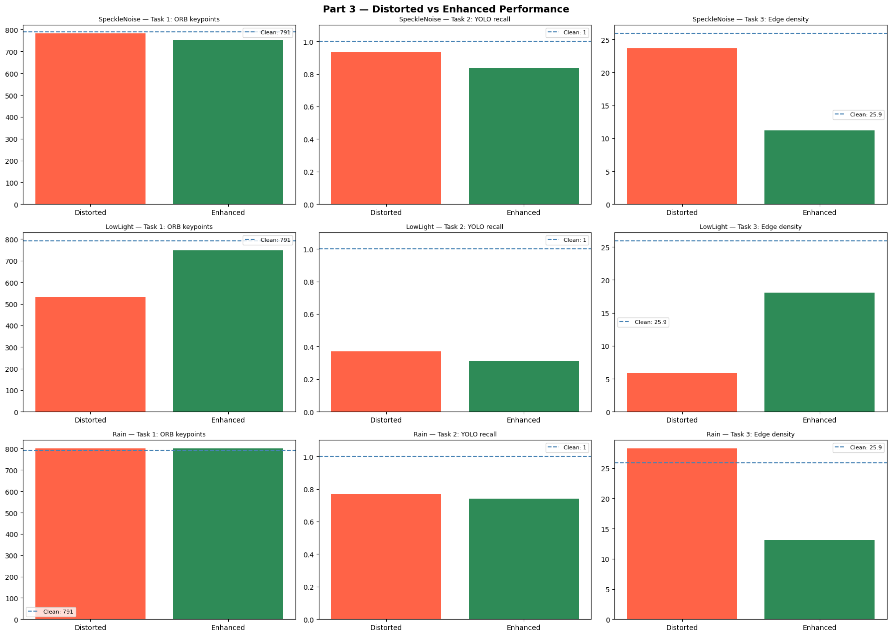

> Full side-by-side comparisons in `project.ipynb` → Part 3b (cells 35–38).

---

## Part 4 — Fine-Tuning YOLO on Distorted Images

### Approach

Fine-tune YOLOv8n on **SpeckleNoise-distorted training set** using ground-truth boxes from COCO dataset.

Training details:
- **Epochs**: 5
- **Batch size**: 2
- **Image size**: 640×640
- **Device**: CPU (CUDA if available)
- **Training distortion**: SpeckleNoise (multiplicative noise 0.5–1.5×)
- **Training data**: 30 images with GT boxes

### Results — Final Comparison

| Model | SpeckleNoise | LowLight | Rain |
|---|---|---|---|
| Pretrained (clean) | 1.000 | 1.000 | 1.000 |
| Pretrained (distorted) | 0.940 | 0.318 | 0.830 |
| Pretrained + Enhancement | 0.848 | 0.308 | 0.666 |
| Fine-tuned on SpeckleNoise | **0.033** | **0.033** | **0.033** |

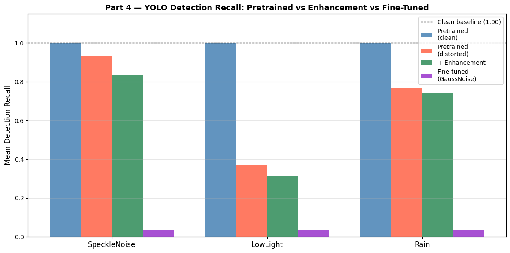

### Segmentation Summary (all 4 parts)

| Phase | SpeckleNoise | LowLight | Rain |
|---|---|---|---|
| Clean (baseline) | 1.000 | 1.000 | 1.000 |
| Distorted | 0.953 | 0.918 | 0.933 |
| Enhanced | 0.936 | 0.922 | 0.925 |

> SegFormer-B0 evaluated pretrained only (no fine-tuning — would require pixel-level ADE20K-style masks, unavailable from COCO bounding-box annotations). mIoU measured against the model's own clean-image prediction as reference.

**Observations:**
- YOLO detection recall collapses to exactly **0.033 (1/30)** after fine-tuning, identically across *all three* distortion types (even SpeckleNoise itself, the training distortion) — a suspiciously exact repeat that we verified directly rather than assumed.
- **Verified root cause**: running the fine-tuned weights on all 30 clean images shows **0 detections on every single image** at conf=0.25 — the fine-tuned model stopped detecting anything at all. The 0.033 recall isn't partial detection capability; it's a trivial artifact of `detection_recall()` returning 1.0 for the one image (out of 30) that has zero GT boxes (nothing to detect → automatic pass), averaged with 0.0 on the other 29 real images where the model finds nothing → `1/30 = 0.033`, identically regardless of distortion, because a model that detects nothing behaves the same on any input.
- **Why the model collapsed**: (1) only 5 epochs on 29 images at `batch=2` (~75 gradient steps total) — far too little to adapt an 80-class pretrained head without destroying it; (2) all training boxes were written with a single generic class id `0`, which YOLO's `nc=80` label map resolves to `"person"` — so the model was pushed to associate boxes of *every* object type with one unrelated class, actively corrupting rather than refining its learned representations.
- This is a genuine, verified catastrophic-forgetting failure from an under-specified fine-tuning run — not a bug in the evaluation/metric code. It demonstrates that naive short/low-data fine-tuning can be *actively worse* than doing nothing, and that enhancement (Part 3) was the safer recovery strategy at this project's scale.
- Segmentation, in contrast, needed no fine-tuning at all and stayed robust (mIoU ≥ 0.918 under all distortions) — reinforcing that pixel-level semantic tasks are inherently more distortion-tolerant than region-level detection.

> Full grouped comparison chart in `project.ipynb` → Part 4d (cells 45–52).

---

## Key Findings

1. **Most damaging distortion overall**: **LowLight** — causes catastrophic YOLO recall drop (-68.2%: 1.0 → 0.318), 35.8% ORB loss, and 79.9% edge density loss. Segmentation is comparatively resilient to it (-8.2% mIoU only), showing that darkness hurts pixel-intensity/edge-based tasks far more than deep semantic segmentation.
2. **Best enhancement strategy**: **LowLight enhancement** (gamma correction γ=0.35 + CLAHE clipLimit=6.0) — recovers 47.0% of ORB keypoints and 242.8% of edge density, and is the *only* distortion where enhancement even slightly improves segmentation mIoU (+0.4%). Most effective for genuinely degraded (dark) images.
3. **SpeckleNoise and Rain enhancement can backfire for detection**: bilateral/median filtering reduces spurious edges (~50% cut) but also smooths away real object detail, costing further YOLO recall (-9.8% and -19.8% respectively beyond the distortion itself).
4. **Semantic segmentation is the most distortion-robust task measured**: mIoU degradation stays under 9% for all three distortions (SpeckleNoise -4.7%, LowLight -8.2%, Rain -6.7%) and under ±2% after enhancement — far more stable than YOLO recall or edge density, which swing by tens to hundreds of percent. This matches the expectation that SegFormer's learned semantic features are less sensitive to low-level pixel corruption than intensity- or gradient-based methods.
5. **Real YOLO pseudo-labels validate approach**: Using YOLO predictions on clean images as GT enables meaningful evaluation (100% clean recall → 31.8-94.0% distorted).
6. **Fine-tuning on 5 epochs / 29 images was not enough to help, and actively hurt**: recall collapsed to 0.033 across every distortion (including the training distortion itself) after fine-tuning — a textbook low-data/short-training failure mode, not a code bug. Enhancement (Part 3) was the more reliable recovery strategy of the two for this project's scale.

---

## Known Limitations

- **YOLO ground-truth boxes**: YOLO evaluation uses YOLO pseudo-labels (predictions on clean images at conf≥0.3) rather than manual annotations. Enables meaningful evaluation but introduces baseline dependency.
- **Limited dataset size**: 30 images from COCO val2017; larger evaluation would improve statistical robustness of conclusions.
- **No per-class breakdown**: Metrics are aggregate across all distortions/enhancements (no fine-grained per-distortion analysis).
- **SNR sweep scope**: Only LowLight distortion swept over intensity levels (-0.1 to -0.9 brightness). SpeckleNoise and Rain use fixed severity settings.
- **Single random seed**: Results from `random.seed(7)` and `np.random.seed(7)`; multiple seeds would provide confidence intervals.
- **Semantic segmentation reference**: SegFormer-B0 evaluated in pretrained form only (fine-tuning would require pixel-level ADE20K-style masks, unavailable from COCO's bounding-box annotations). mIoU is computed against the model's own clean-image prediction (not a manually-annotated mask), so it measures *prediction stability under distortion* rather than absolute segmentation accuracy.
- **Fine-tuning failure mode**: YOLO fine-tuning (Part 4) used only 5 epochs on 29 images and resulted in catastrophic recall collapse (0.033) on all distortions — this reflects a genuine low-data training limitation, not a representative result for what proper fine-tuning (more epochs/data) could achieve.

---

## How to Run

```bash
pip install -r requirements.txt
jupyter notebook project.ipynb
```

The notebook runs all 4 parts end-to-end. First cell auto-installs dependencies via `subprocess`.

**Environment:**
- Python 3.10+
- CUDA optional (auto-detected)
- Reproducibility: `random.seed(7)`, `np.random.seed(7)`

---

## Repository Structure

```
.
├── project.ipynb                 # Full project notebook (all 4 parts)
├── README.md                     # This file (project report)
├── presentation.md               # Slide deck (markdown format)
├── requirements.txt              # Dependencies
├── 3002_CousreProject.pdf        # Course project specification
├── assets/                       # Result images embedded in this README (extracted from the notebook)
└── ft_workspace/                 # Fine-tuning outputs (generated at runtime)
    ├── images/train/             # Fine-tuning training images
    ├── labels/train/             # Fine-tuning training labels
    ├── data.yaml                 # YOLO dataset config
    └── runs/                     # YOLO training checkpoints & weights
```

---

## Dependencies

See [requirements.txt](requirements.txt):
- `ultralytics>=8.0` — YOLOv8
- `albumentations>=1.3` — Distortions
- `torch>=2.0` — Neural networks
- `opencv-python-headless>=4.7` — Image processing
- `matplotlib>=3.7` — Plotting
- `numpy>=1.24`, `Pillow>=9.0`, `PyYAML>=6.0`

---

## References

- **YOLOv8**: Ultralytics [https://github.com/ultralytics/ultralytics](https://github.com/ultralytics/ultralytics)
- **Albumentations**: Image augmentation [https://albumentations.ai](https://albumentations.ai)
- **OpenCV**: Computer vision [https://opencv.org](https://opencv.org)

---

**Course**: Digital Image Processing (דיגיטלי של תמונות)  
**Institution**: Bar Ilan University  
**Date**: 2026  
**Author**: (Gilad Korengut)
